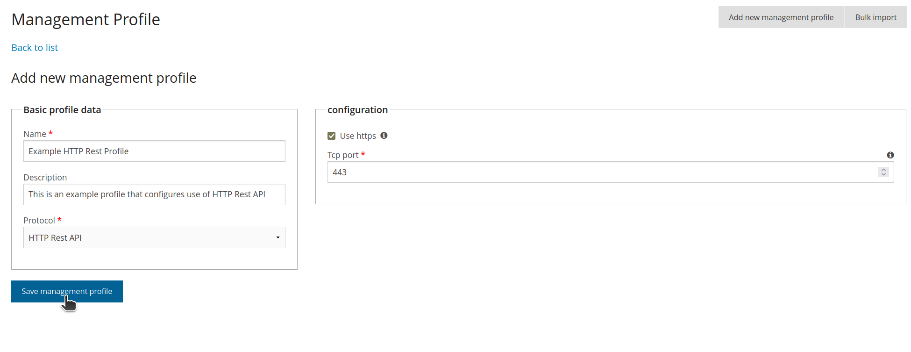

===============================================================
Adding support for a new protocol in management profiles
===============================================================

This guide shows how to add a new protocol option for management
profiles.

A quick intro to management profiles
====================================

A netbox can have any number of management profiles. A management
profile represents a specific protocol that we can use to communicate
with the netbox and the configuration details needed to do so.
Configuration details for the protocol are supplied by the user in the
*Add new management profile* web form when seeding the database.

The web form is processed by NAV and stored in the database as a
:py:class:`ManagementProfile`.  Custom,
protocol-specific, configuration from the web form is added to the
resulting management profile's ``configuration`` dict.

The act of adding support for a new management profile protocol is an
act of informing NAV about the new protocol and, if needed, declaring
a new web form for the protocol's configuration details and informing
NAV about this web form as well. The rest (displaying the form,
processing the completed form and storing the resulting management
profile) is taken care of by other parts of NAV.

Of course, after adding support for a new protocol in management
profiles, you've only added a new, protocol-specific, configuration
option for a netbox. This configuration should have a raison d'être;
next up, you'll have to add functionality in other parts of NAV which
looks for this configuration and uses it to communicate with the netbox.

.. tip::
   You may use ``netbox.profiles.filter(protocol=PROTOCOL)`` on a
   :py:class:`Netbox` instance ``netbox`` to look up all its management
   profiles that has the protocol identifier PROTOCOL.

The goal
========

Add the option to specify "HTTP Rest API" as the protocol for a
management profile.

Code
====

Protocol without custom configuration details
---------------------------------------------

Adding a protocol that only uses the default set of profile
data (*name*, *description*, and *protocol ID*) and no custom
configuration details is simple. In the :py:class:`ManagementProfile`
class, declare a suitingly named PROTOCOL constant and add it to
``ManagementProfile.PROTOCOL_CHOICES``:

.. code-block:: python
    :caption: python/nav/models/manage.py
    :emphasize-lines: 5, 10

    class ManagementProfile(models.Model):
        PROTOCOL_SNMP = 1
        PROTOCOL_NAPALM = 2
        PROTOCOL_SNMPV3 = 3
        PROTOCOL_HTTP_REST = 4  # Our new PROTOCOL constant, holds the new protocol's ID
        PROTOCOL_CHOICES = [
            (PROTOCOL_SNMP, "SNMP"),
            (PROTOCOL_NAPALM, "NAPALM"),
            (PROTOCOL_SNMPV3, "SNMPv3"),
            (PROTOCOL_HTTP_REST, "HTTP Rest API"),  # Used when listing protocols in the web form
        ]

.. image:: add-management-profile-basic.png

After this change, users will be able to add new management profiles
with the new protocol in the web form (bulk import is also
supported). Users can then assign the management profile to netboxes
to inform NAV that they support that protocol.

.. tip:: In ipdevpoll plugins where you pull data from a netbox using
         the new protocol, you can with this basic management profile
         now determine if the plugin supports a given netbox by
         looking up the netbox's management profiles and see if any
         has a protocol identifier matching the identifier of your new
         protocol.

Adding custom configuration details
-----------------------------------
We now want to extend the web form so that it allows assigning custom
configuration details that will be stored in the management profile's
``configuration`` dict after the form is
processed. To do this (see also the code block below),

* create a Django ModelForm form (by subclassing :py:class:`django.forms.ModelForm`) in ``python/nav/web/seeddb/page/management_profile/forms.py``. It should have one field per entry you want stored in the profile's ``ManagementProfile.configuration`` dict after the form is processed,

* make this form also inherit the :py:class:`ProtocolSpecificMixin` mixin (which needs to come before :py:class:`django.forms.ModelForm` in the method resolution order), and

* declare the ``PROTOCOL`` and ``PROTOCOL_CHOICES`` constants so that NAV is able to discern which protocol's config this form represents.

.. note::
    exchange ``PROTOCOL_HTTP_REST`` below with the name of your new
    protocol's constant.

.. code-block:: python
    :caption: python/nav/web/seeddb/page/management_profile/forms.py

    class HttpRestForm(ProtocolSpecificMixIn, forms.ModelForm):
        PROTOCOL = ManagementProfile.PROTOCOL_HTTP_REST
        PROTOCOL_CHOICES = PROTOCOL_CHOICES.get(PROTOCOL)

        class Meta(object):
            model = ManagementProfile
            configuration_fields = ['https', 'tcp_port'] # These are the keys of the custom configuration
            fields = []

        # This becomes the value of ManagementProfile.configuration["https"]
        https = forms.BooleanField(
            initial=True,
            required=False,
            label="Use https",
            help_text="Uncheck this if http should be used instead of https",
        )

        # This becomes the value of ManagementProfile.configuration["tcp_port"]
        tcp_port = forms.IntegerField(
            required=True,
            help_text="TCP port that the HTTP Rest server listens to",
            min_value=1,
            max_value=65535,
        )

This form will now be remembered as the custom configuration form for
your new protocol, (namely because the form inherits
:py:class:`ProtocolSpecificMixIn` and declares the new protocol's ID
in ``ProtocolSpecificMixIn.PROTOCOL``. NAV searches all subclasses of
:py:class:`ProtocolSpecificMixIn` on module load). The form will be
displayed alongside the basic *add new management profile* form. When
the form is processed, a new :py:class:`ManagementProfile` instance is
stored in the database, and each string in
``Meta.configuration_fields`` will be a key in the
instance's ``configuration`` dict, with values extracted from
the django form fields with corresponding names.
