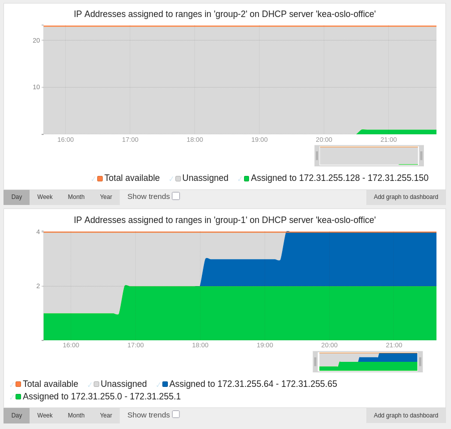

==========
DHCP Stats
==========

Introduction
============

What DHCP servers are supported?
--------------------------------

NAV can request and collect stats from DHCP servers if they expose an API for
this purpose. Alternatively, if a DHCP server does not expose an API for
fetching stats, a standalone script running on the DHCP server itself can send
stats directly to NAV's Graphite/Carbon timeseries database endpoint.

NAV currently supports collecting stats from two DHCP server implementations:

:ref:`kea_dhcpv4_servers`
   Configure at minimum a Kea DHCPv4 HTTP/HTTPS control socket, and assign each
   pool in the Kea DHCPv4 configuration a pool ID, and NAV can start collecting
   IPv4 stats from each Kea DHCPv4 pool over the control socket.
:ref:`isc_dhcpv4_servers`
    Install the external ``dhcpd-pools`` program and the
    ``isc_dhcpd_graphite.py`` NAV contrib script on a machine running an ISC
    DHCP server, and periodically run the contrib script with a period of 5
    minutes between each run to start sending stats to NAV's Graphite/Carbon
    timeseries database endpoint.

What stats are collected?
-------------------------

Total addresses (IPv4)
   The total amount of IP addresses controlled by the DHCP server.
Assigned addresses (IPv4)
   The amount of IP addresses that are in use (assigned to clients or used by
   misbehaving clients).
Declined addresses (IPv4)
   The amount of IP addresses that are used by misbehaving clients (and thus not
   available for assignment).

DHCP server implementations may expose these stats on a per-subnet basis.
Furthermore, they may expose the stats on the more fine per-pool basis. Lastly,
they may even partition pool stats into stats on a per-range basis. For a given
DHCP server, NAV collects stats of the finest detail level possible; i.e. it
prioritizes stats on a per-range basis, followed by per-pool basis, and attempts
to collect stats on a per-subnet basis only as a last resort.

.. admonition:: Terminology clarification

   Different DHCP server implementations seem to use the term *pool* in one of
   two slightly different ways.

   A pool is in both cases a set of IP addresses of a subnet that
   a server is allowed to use when allocating IP addresses to
   clients of a certain class.

   Some DHCP server implementations do not put any further restrictions on this
   set. This is also how NAV defines a pool. Other implementations require the
   set to contain all IP addresses between the set's first and last IP
   address. NAV defines this as a *range* instead.

   Discerning between pools and ranges allow NAV to be extra detailed when
   displaying stats for a range; NAV knows the exact set of IP addresses of a
   DHCP range, whereas it only knows the first and last IP address of a
   DHCP pool.

NAV records the following information for each range/pool/subnet:

* :ref:`The name of the server <dhcpstats_server_name_definition>` the stat originates from
* :ref:`The name of the group <dhcpstats_group_name_definition>` the range/pool/subnet the stat was collected from belongs to
* The first IP address of the range/pool/subnet
* The last IP address of the range/pool/subnet

.. note::

   The information above is stored as part of each stat's Graphite/Carbon path.
   Thus keep in mind that both server names and group names must consist
   exclusively of english letters, digits, underscores, and hyphens as per usual
   in Graphite/Carbon. (Other characters may be replaced with an arbitrary
   conforming character or removed.)

Using this information, NAV has no problem discerning between stats originating
from different ranges/pools/subnets having the same (usually private) IP
addresses as long as either

* the ranges/pools/subnets each originate from different DHCP servers, or
* the ranges/pools/subnets each belong to different groups.

Thus, in case you manage two ``pool 192.168.0.0/24`` (for two separate private
networks), NAV will be able to discern between the two pools and store their
stats separately if either they originate from two differently named DHCP
servers or if they originate from the same DHCP server but belong to two
differently named groups.

.. _dhcpstats_server_name_definition:
Server names
  Server names are used to identify a specific DHCP server *instance* (not the
  name of a DHCP server *implementation*) so that stats from different DHCP servers
  doesn't get intermingled.

  They are usually set in the *dhcpstats.conf* NAV configuration file along with
  other per-server-instance options; the sole exception to this is for
  standalone scripts meant to run on the DHCP server itself and not by NAV. In
  this latter case, server names are usually given as a command-line argument to
  the script.

.. _dhcpstats_group_name_definition:
Group names
  Group names are used to give a common name to ranges/pools/subnets that serve
  the same class of clients so that they may be grouped together when displayed
  in NAV and treated as a single unit.

  Since ranges/pools/subnets in the same group are supposed to be treated as a
  unit, there's intentonally no way to give names to each range/pool/subnet in a
  group. If you want a unique name per range/pool/subnet you manage, this is a
  sign that they shouldn't be in the same group; and as such they should reside
  in their own singleton groups with unique names.

  The specifics of how NAV finds which group names are assigned to which
  ranges/pools/subnets varies from one DHCP implementation to another, since
  such grouping by no means is a standardized feature in DHCP servers, and
  especially not always something which is exposed over an API. Details are
  given in each specific DHCP server's section :ref:`further down in this
  document <dhcpstats_configuration>`. If NAV can't infer the group name for
  some given range/pool/subnet, NAV will assign it to a special standalone
  group.

.. tip::

   You can easily track the stats of all of a group's ranges/pools/subnets, even
   in the inevitable event that the set of addresses (or other identifying
   qualities) that constitute one or more ranges/pools/subnets change.

   For example, if you have a group of ranges with the group name ``kea-oslo-office``
   and server name ``kea-oslo``, stored under ``nav`` in Graphite,
   the timeseries representing the total amount of assigned IPv4 addresses in this
   group will always be given by

   .. code-block:: none

     sumSeries(nav.dhcp.4.kea-oslo.range.custom_groups.kea-oslo-office.*.*.assigned)

   Of course, if you just want to track one range of that group, say one which
   is configured on your DHCP server to exactly serve the range
   ``range 203.0.113.1 - 203.0.113.125``, the timeseries representing the
   total amount of assigned IPv4 addresses in this range is given by

   .. code-block:: none

     nav.dhcp.4.kea-oslo.range.custom_groups.kea-oslo-office.203_0_113_1.203_0_113_125.assigned

Where can I see the stats in NAV?
---------------------------------

Any recently enough collected DHCP stats are displayed on two types of pages in
NAV you're probably familiar with:

* The stats collected for a group of ranges/pools/subnets is displayed in a
  VLAN's page in NAV if at least one IP address contained in the group also is
  contained in that VLAN.

* The stats collected for a group of ranges/pools/subnets is displayed in a
  Prefix's page in NAV if at least one IP address contained in the group also is
  contained in that Prefix.

Thus, say NAV has collected stats for the ranges ``range 203.0.113.0/25`` and
``range 203.0.113.128/25``. Then both ranges will appear on the prefix page in
NAV for prefix ``203.0.113.0/24``. If the ranges are part of the same group,
they will be shown side-by-side. Otherwise, they will be shown separately.

Continuing with the above example, if somehow the prefix ``203.0.113.192/26``
exists in NAV, the range ``range 203.0.113.128/25`` will be shown in the page
for this prefix, since there is an IP address overlap. The range ``range
203.0.113.0/25`` doesn't have an IP address overlap, so it will only be shown
on the prefix page for ``203.0.113.192/26`` if it is part of the same group as
``range 203.0.113.128/25``.

.. _dhcpstats_configuration:

Configuration
=============

.. _kea_dhcpv4_servers:

Kea DHCPv4 Servers (IPv4)
----------------------------
.. note::

    NAV works with Kea versions 2.4.0 and above. The most recent version known
    to work with NAV is Kea version 3.0.0.

.. note::

   NAV does not require that any hook libraries have been installed into the Kea
   DHCPv4 server (see *Hook Libraries* in `kea.readthedocs.io
   <https://kea.readthedocs.io/en/kea-3.0.1/arm/hooks.html#hook-libraries>`_).
   Kea offers a hook that adds extra API commands which become necessary to use
   if one wants reliable stats when using a setup where multiple Kea servers share
   the same underlying lease database (see *Statistics Commands for
   Supplemental Lease Statistics* in `kea.readthedocs.io
   <https://kea.readthedocs.io/en/kea-3.0.1/arm/hooks.html#libdhcp-stat-cmds-so-statistics-commands-for-supplemental-lease-statistics>`_);
   if you run such a setup, keep in mind that NAV does not make use of this hook,
   so stats may in this case be unreliable. [#f1]_

A pool in Kea is a range in NAV. NAV collects IPv4 stats from Kea DHCPv4 servers
on a per-Kea-pool-basis (or, from NAVs perspective: a per-range-basis). We'll
walk through the steps needed to configure the Kea DHCPv4 server and NAV in
order to start collecting stats. Repeat the steps for each Kea DHCPv4 server
you'd like to collect stats from.

Configuring Kea DHCPv4
^^^^^^^^^^^^^^^^^^^^^^

.. note::

    Kea versions 2.x.x are configured in a slightly different manner than Kea
    versions 3.x.x. The configuration steps below are described with Kea
    versions 3.x.x in mind; the steps needed for Kea versions 2.x.x should be
    straightforward to infer. Nonetheless, we've included working examples for
    both :ref:`Kea versions 3.x.x <kea_3_x_x_configuration_example>` and
    :ref:`Kea versions 2.x.x <kea_2_x_x_configuration_example>` further below.

1. A control socket that serves the Kea API of the Kea DHCPv4 server needs to be
   set up with a ``socket-type`` of ``http`` or ``https`` and a
   ``socket-address`` plus ``socket-port`` combination reachable either directly
   or through a reverse proxy by NAV (see *Control Socket* in
   `kea.readthedocs.io
   <https://kea.readthedocs.io/en/kea-3.0.1/arm/dhcp4-srv.html#http-https-control-socket>`_).
   NAV needs access to the three API commands `config-get
   <https://kea.readthedocs.io/en/kea-3.0.1/api.html#config-get>`_,
   `config-hash-get
   <https://kea.readthedocs.io/en/kea-3.0.1/api.html#config-hash-get>`_ and
   `statistic-get-all
   <https://kea.readthedocs.io/en/kea-3.0.1/api.html#statistic-get-all>`_. For
   security purposes, consider disabling access to any other API command or at
   least disabling write access over the control socket (as of Kea version
   3.0.0, either of these restrictions oddly enough only seem to be available
   through the quite complex `RBAC premium hook
   <https://kea.readthedocs.io/en/kea-3.0.1/arm/hooks.html#libdhcp-rbac-so-role-based-access-control>`_).
   Also consider enabling client SSL certificate authentication (see either your
   reverse proxy's TLS documentation or *TLS/HTTPS Configuration* in `kea.readthedocs.io
   <https://kea.readthedocs.io/en/kea-3.0.1/arm/security.html#tls-https-configuration>`_).
   As stated above, `config-get
   <https://kea.readthedocs.io/en/kea-3.0.1/api.html#config-get>`_ must be
   available for NAV to use; therefore you should consider whether there's information in
   the Kea configuration (such as user passwords) that are too sensitive to be
   served.

   .. note::

      The `config-get
      <https://kea.readthedocs.io/en/kea-3.0.1/api.html#config-get>`_ API
      command is needed to collect stats from each Kea pool since pool IDs are
      not known beforehand by NAV (and as of the latest Kea version, version
      3.0.0, no fit for purpose API command exist to obtain pool IDs). The
      `network4-list
      <https://kea.readthedocs.io/en/kea-3.0.1/api.html#network4-list>`_ and
      `subnet4-list
      <https://kea.readthedocs.io/en/kea-3.0.1/api.html#subnet4-list>`_ API
      commands (open-sourced in Kea starting with version 3.0.0) could
      alternatively have been used to instead collect stats from each Kea subnet
      if access to the `config-get
      <https://kea.readthedocs.io/en/kea-3.0.1/api.html#config-get>`_ API
      command is disabled by an administrator. Neither defaulting to nor falling
      back to using `network4-list
      <https://kea.readthedocs.io/en/kea-3.0.1/api.html#network4-list>`_ and
      `subnet4-list
      <https://kea.readthedocs.io/en/kea-3.0.1/api.html#subnet4-list>`_ is
      however currently supported by NAV.

2. Each pool in the Kea DHCPv4 configuration **must** be manually assigned a
   unique pool ID (see the note on pool IDs under *Statistics in the DHCPv4
   Server* in `kea.readthedocs.io
   <https://kea.readthedocs.io/en/kea-3.0.1/arm/dhcp4-srv.html#statistics-in-the-dhcpv4-server>`_).

3. Each pool in the Kea DHCPv4 configuration
   **may** be manually assigned a user-context containing the key ``group``
   whose value is the name of the pool's group consisting of english letters,
   digits, underscores and/or hyphens.

.. _kea_3_x_x_configuration_example:

Kea Version 3.x.x Example
~~~~~~~~~~~~~~~~~~~~~~~~~

A minimal Kea version 3.x.x DHCPv4 configuration may thus look like this (notice the keys
``pool-id`` and ``user-context`` for each pool):

.. code-block:: json
   :caption: /etc/kea/kea-dhcp4.conf

    {
      "Dhcp4": {
        "subnet4": [
          {
            "subnet": "172.31.255.0/24",
            "pools": [
              {
                "pool": "172.31.255.0/26",
                "pool-id": 1,
                "user-context": {
                  "group": "second-floor"
                }
              },
              {
                "pool": "172.31.255.64/26",
                "pool-id": 2,
                "user-context": {
                  "group": "second-floor"
                }
              },
              {
                "pool": "172.31.255.128 - 172.31.255.150",
                "pool-id": 3,
                "user-context": {
                  "group": "first-floor"
                }
              }
            ],
            "id": 1
          }
        ],
        "control-sockets": [
          {
            "socket-type": "https",
            "socket-address": "10.20.30.40",
            "socket-port": 5060,
            "trust-anchor": "/path/to/the/ca-cert.pem",
            "cert-file": "/path/to/the/agent-cert.pem",
            "key-file": "/path/to/the/agent-key.pem",
            "cert-required": true
          }
        ]
      }
    }

.. _kea_2_x_x_configuration_example:

Kea Version 2.x.x Example
~~~~~~~~~~~~~~~~~~~~~~~~~

Control sockets in Kea versions 2.x.x are configured in a slightly different
way, because the handling of HTTP/HTTPS requests is delegated to a separate
program (the *Kea Control Agent*) which is configured separately.

Thus, a minimal Kea DHCPv4 configuration may look like this instead:

.. code-block:: json
   :caption: /etc/kea/kea-dhcp4.conf

    {
      "Dhcp4": {
        "subnet4": [
          {
            "subnet": "172.31.255.0/24",
            "pools": [
              {
                "pool": "172.31.255.0/31",
                "pool-id": 1,
                "user-context": {
                  "group": "second-floor"
                }
              },
              {
                "pool": "172.31.255.64/31",
                "pool-id": 2,
                "user-context": {
                  "group": "second-floor"
                }
              },
              {
                "pool": "172.31.255.128 - 172.31.255.150",
                "pool-id": 3,
                "user-context": {
                  "group": "first-floor"
                }
              }
            ],
            "id": 1
          }
        ],
        "control-socket": {
          "socket-type": "unix",
          "socket-name": "/run/kea/control-socket-4"
        }
      }
    }

...followed by a minimal Kea Control Agent configuration that may look like this:

.. code-block:: json
   :caption: /etc/kea/kea-ctrl-agent.conf

    {
      "Control-agent": {
        "http-host": "10.20.30.40",
        "http-port": 5060,
        "trust-anchor": "/path/to/the/ca-cert.pem",
        "cert-file": "/path/to/the/agent-cert.pem",
        "key-file": "/path/to/the/agent-key.pem",
        "cert-required": true,
        "control-sockets": {
          "dhcp4": {
            "socket-type": "unix",
            "socket-name": "/run/kea/control-socket-4"
          }
        }
      }
    }

.. _kea_dcpv4_servers_configuring_nav:

Configuring NAV
^^^^^^^^^^^^^^^

1. Decide upon a unique server name consisting of english letters, digits,
   underscores and/or hyphens to give the Kea DHCP server; we'll use the
   arbitrary name ``kea-oslo-office`` in this example.

2. Find the URL of the control socket that serves the Kea API of the Kea DHCPv4
   server (we'll assume the URL is ``https://example.org:5060/`` which,
   following the Kea configuration examples above, should resolve to
   ``https://10.20.30.40:5060/``).

Then, add a new section to the NAV *dhcpstats.conf* file, like so:

.. code-block:: ini
   :caption: ${configdir}/dhcpstats.conf

   [server_kea-oslo-office]
   type=kea-dhcp4
   url=https://example.org:5060/

The above is a minimal working configuration for NAV to start collecting IPv4
stats from the Kea API at ``https://example.org:5060/``. Notice a few things:

* The section name starts with ``server_`` to inform NAV that the section
  configures a server. The part after ``server_`` is ``kea-oslo-office``, which
  becomes the name of the configured server in NAV.
* The ``type=kea-dhcp4`` option informs NAV that this section configures a Kea
  DHCPv4 server. This option must be included in all sections that configure Kea
  DHCPv4 servers.
* The ``url=...`` value must be a URL with HTTP or HTTPS as scheme.

Some additional options can be given depending on your specific setup. Here's a fully
configured Kea DHCPv4 server section:

.. code-block:: ini
   :caption: ${configdir}/dhcpstats.conf

   [server_kea-oslo-office]
   type=kea-dhcp4
   url=https://example.org:5060/
   timeout=5.0
   http_basic_username=nav
   http_basic_password=cfcc3475c4de4f0484a4a475ec0a6edd
   client_cert_path=/etc/client-cert.pem
   client_cert_key_path=/etc/client-cert-key.pem
   user_context_groupname_key=group-name

* Set the ``timeout`` option to specify how many seconds NAV should wait for an
  HTTP response from the Kea API before timing out (NAV defaults to
  5.0s).

* Set the ``http_basic_username`` and ``http_basic_password`` options to specify
  that NAV should authenticate to the API using HTTP Basic Authentication
  with the given username and password.

* Set the ``client_cert_path`` and ``client_cert_key_path`` options to specify
  that NAV should authenticate to the API using client-side SSL certificates.
  ``client_cert_path`` specifies the path to a file containing the client's
  certificate. ``client_cert_key_path`` specifies the path to a file containing
  the client's private key. You can optionally omit ``client_cert_key_path`` and
  only specify ``client_cert_path``; in this case, it is assumed that
  ``client_cert_path`` specifies the path to a file containing both the client's
  certificate and its private key.

* Set the ``user_context_groupname_key`` to specify what key inside the
  ``user-context`` objects of the Kea DHCPv4 configuration NAV should use to look
  up the group name for each Kea pool (NAV defaults to the key ``group`` when
  looking up the group name of a Kea pool).

.. note::

   There's currently no option to manually specify root certificates that NAV
   should trust when verifying the identity of HTTPS servers; NAV uses Mozilla's
   list of root certificates as provided by the certify Python package.

.. _isc_dhcpv4_servers:

ISC DHCP Servers (IPv4)
-----------------------

NAV ships with a contrib script named ``isc_dhcpd_graphite.py`` that sends stats
to NAV on a per-range-basis. We'll walk through the steps needed to configure
the script on the ISC DHCP server machine and configuring NAV in order to start
collecting stats. Repeat the steps for each ISC DHCP server you’d like to
collect stats from.

Configuring the ISC DHCP Server Machine
^^^^^^^^^^^^^^^^^^^^^^^^^^^^^^^^^^^^^^^

Install the external ``dhcpd-pools`` program on the server machine (see e.g. `tracker.debian.org <https://tracker.debian.org/pkg/dhcpd-pools>`_).

Install the ``isc_dhcpd_graphite.py`` contrib script on the server machine:

.. code-block:: console

    $ OUTFILE='/usr/local/bin/isc_dhcpd_graphite.py'
    $ URL='https://github.com/Uninett/nav/raw/refs/heads/master/contrib/scripts/isc_dhpcd_graphite/isc_dhpcd_graphite.py'
    $ curl --follow "$URL" | sudo tee "$OUTFILE"
    $ sudo chmod 755 "$OUTFILE"

The contrib script is configured through command-line arguments:

.. program-output:: python ../contrib/scripts/isc_dhpcd_graphite/isc_dhpcd_graphite.py --help

To run the contrib script periodically every 5 minutes, you can add the
following crontab entry:

.. code-block:: none

    */5 * * * * isc_dhcpd_graphite.py --server-name 'dhcpd-oslo-staff' --prefix 'nav_contrib' --config-file '/etc/dhcpd/dhcpd.conf' --command '/usr/bin/dhcpd-pools' --protocol 'text' --port '2003' 'https://nav.graphite.example.org/'

Make sure the cronjob is being run as some user with read access to the ISC DHCP
server's leasefile and config.

Configuring NAV
^^^^^^^^^^^^^^^

Nothing needs to be configured in NAV, but make sure NAV's Graphite server
(whose URL should be given as the positional argument to
``isc_dhcpd_graphite.py``) is reachable from the ISC DHCP server machine.

-----

.. [#f1] The two main reasons that NAV doesn't make use of this hook is that it
         is not loaded into Kea by default, and that the stats that it provides
         are more coarse-grained (stats are per subnet) than those provided
         through standard API commands used by NAV (where stats are per Kea
         pool).
